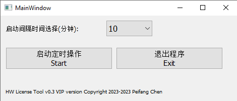
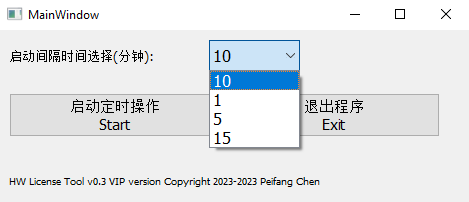
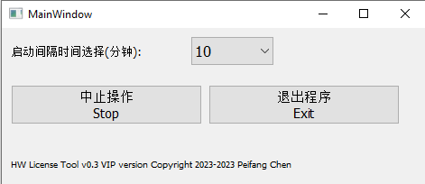

# HW License Tool  
How to use this tool  

## 1. 适用范围  
* 当前软件最新版本号：**V0.5 VIP** beta (修复弹窗bug)  
    - 相比V0.4：修复弹窗bug, 运行更加隐蔽；修复VIP使用时段23：59报错bug。  
    - 目前V0.4 VIP sys版本昨晚测试通过，有弹窗bug但不影响使用，可以下载此版本。  
    - **V0.5 VIP beta版本尚未进行测试，可能存在无法保留license风险**。  
* 支持**HyperGraph/HyperView软件单一窗口**  
* 尚不支持**多窗口**  
* 尚不支持**HyperMesh**及其他  

## 2. 免费试用时段  
* 免费试用时段为早 **00:00 - 12:00**  
* **当前测试阶段暂开放部分VIP用户**
    - 本次更新已免费将系统组用户加入VIP
    - VIP用户全天可用  
    - VIP与**个人电脑账号即工号**绑定，更换工号后无法使用

## 3. 使用方法  
* **打开exe文件**，进入如下界面:  
  

* **下拉菜单**，选择启动时间间隔，默认为10分钟.  
 

* 打开HyperGraph或者View的目标窗口, 把本程序窗口**放在目标窗口上**, 点击 ‘Start’。你应该会看到目标窗口最大化/最小化了一下，说明启动成功。如果没有看到，请按 **“Stop”键**，**再重新尝试**本操作步骤。(V0.5版本更新算法，会取消窗口显示功能，隐蔽运行)  

* 正常启动后，程序会定时打开目标窗口，执行一步操作，防止license丧失。使用过程中，每隔刚才设置的间隔时间，目标窗口会突然跳出来，**请勿惊慌**。(V0.5版本更新算法，会取消窗口显示功能，隐蔽运行)  

* 使用过程中，可以随时：
    - 按下 **“Stop”键**，中止程序继续运行。后面可以重新开始。  
    - 按下 **“Exit”建**，完全退出程序。  
       
