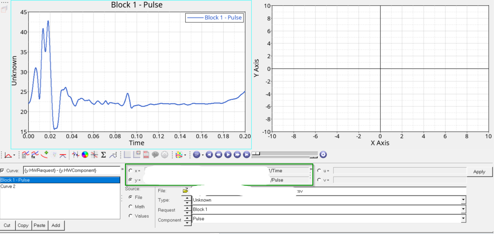
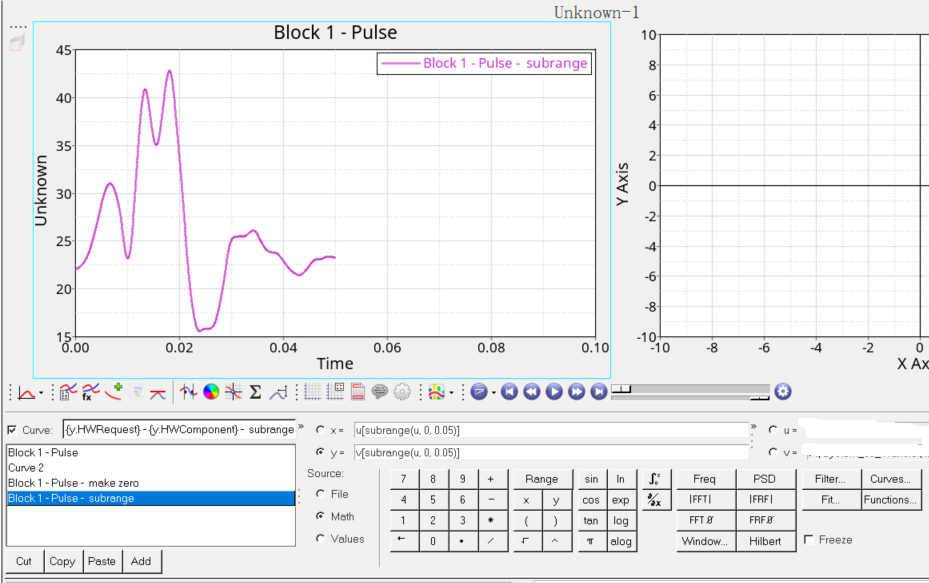
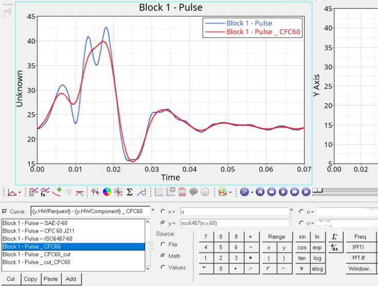
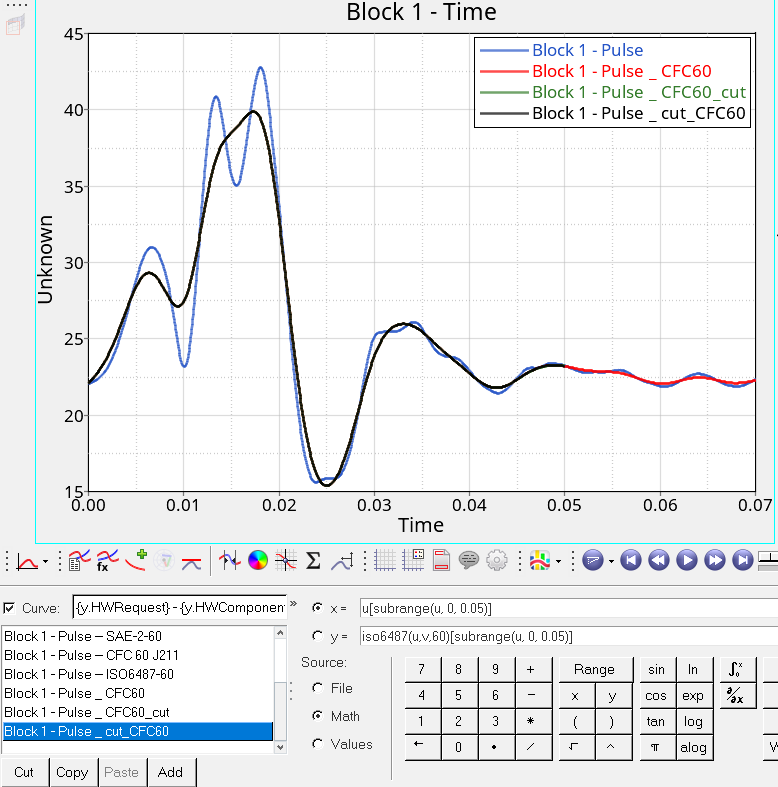

# HyperGraph
some tips for HyperGraph

## 1. 一些引用和表达式  
* HG里面的的界面分类从大到小为：Page ==> Window ==> Cuvre  
如下图所示，第一页是**p1**, 每页的第一个窗口是**w1**, 每个窗口的第一个曲线是**c1**.  
如果想表示第一页第一个窗口第一条曲线, 那就是**p1w1c1**.  
同理，第二页第三个窗口第一条曲线就是**p2w3c1**.  

* 每条曲线的横坐标由底下的**x/y**包含的数据展示  
下图显示的例子, **x/y的source来源是file**, 分别读取自一个**csv文件**的**time列**和**Pulse列**.  

但是，**x/y**也可以表示成函数表达式的显示, **source来源这时候要选择Math**.  
比如:  
  - 我们可以让**u/v**读取文件的数据, 而**x/y**分别表示成**u/v**的函数.  
  下图就是让**x=u, y=v**, 这样和上图展示的曲线是等价的.  
  
  - **x/y**引用其他曲线的数据.  
  下图有一条新的红色曲线**Curve 2**, 它的**x = p1w1c1.x**表示引用第一根曲线**p1w1c1的横坐标x数据**, 它的**y = p1w1c1.y*(-1)**表示引用了第一根曲线**p1w1c1的纵坐标y数据 并乘以-1**.  
  
  

  
* 小结

  目标|表达式
  :-|:-
  引用某一条曲线|p?w?c?  (p1w1c1 表示第一页第一个窗第一条曲线)
  引用某一条曲线的x|p?w?c?.x  (?替换成需要的数字)
  引用某一条曲线的y|p?w?c?.y  (?替换成需要的数字)

## 2. 输出显示
区别与在X/Y/U/V界面时候可以直接输入表达式，在HG其他的文本窗口(如Note, Curve Name, Header/Footer等)输入表达式需要使用 **{}** 用于和字符串区分.  

* 比如需要添加一个Note, 显示某条曲线最大值.  
  - 指定显示**p1w1c1.y**最大值显示: **{max(p1w1c1.y)}**  
  这里注意不再 **{}** 内部的字符，按字符串处理，会直接输出.  
  **{}** 内部的会进行计算，把结果输出.  
  
  - 也可以灵活指定当前窗口的曲线，这样可以简写成**c1.y**: **{max(c1.y)}**  
  推荐这种灵活的方式，这样copy Note到其他窗口的时候，**c1.y**还是代指新窗口的曲线，表达式的结果显示也会更新.  
  
  - 和所有语言一样，输出可以指定格式. 我们用的比较多的是2位小数，可以使用 **%.2f**表达**保留2位小数的单精度浮点型数字格式**.  
  回到刚才的例子，可以指定显示当前窗口**c1.y**最大值显示, 保留2位小数: **{max(c1.y), %.2f}**  
  

* 小结  
  目标|表达式
  :-|:-
  字符串|不用 {}, 或者在 {} 外部
  表达式|在 {} 内部
  表达式绝对引用| 比如 {p1w1c1.y}
  表达式相对引用| 比如 {c1.y}
  格式输出显示| {计算表达式, 格式表达式},  比如{max(c1,y), %.2f}

## 3. 0时刻归0操作  
WS假人胸压经常需要使用0时刻归零操作，这时候需要借助**v**读取结果，再把**y表示成v的函数**.  
  目标|表达式
  :-|:-
  某时刻的v值| lininterp(u,v,?)
  0时刻的v值| lininterp(u,v,0)
  曲线y在0时刻归0| y = v-lininterp(u,v,0)  

  备注: 以上表达式使用拟合公式，所以要**保证目标时刻的纵坐标存在，或者目标时刻前后时刻的纵坐标存在**，否则公式无效，在这曲线截断的时候需要注意.  
* 未0时刻归零:  

* 0时刻归零:  

  

## 4. 曲线截断  
有时候，数据包含 **-1-2s**的所有数据，但是我们大部分只需要 **0-0.1s**或者其他时间段的部分数据，这个时候需要用到截断函数 **subrange**.  
  目标|表达式
  :-|:-
  按横坐标时间截断| subrange(u, start time, end time)  (默认u读取了time的数据)
  按横坐标时间截断0-0.1s| subrange(u, 0, 0.1)  (注意单位是s还是ms)
  subrange返回值或者叫计算值| 返回**序列号**而不是**序列的值**
  保留截断的时间里横坐标u的值| u[**序列号**]
  保留截断的时间的纵坐标v的值| v[**序列号**]
  保留截断0-0.1s时间内的u值| u[subrange(u, 0, 0.1)]
  保留截断0-0.1s时间内的v值| v[subrange(u, 0, 0.1)]  (注意这里subrange里面都是u)

* 原始数据，未截断:  

* 截断0-0.05s的数据:  

  

## 5. 滤波  
很多曲线原始的通道数据没有滤波，这个时候需要按需求进行CFC1000/600/180/60等滤波.  
* 滤波的算法有很多, SAE/ SAE-2/ SAE J211/ ISO 6487, 不同滤波算法的结果会有一些差异，目前我对此还没有研究.  

* 以下以**ISO 6487**为例子，介绍滤波公式.  
  目标|表达式
  :-|:-
  对y进行滤波| x= u,  y= iso6487(x,v,滤波等级)
  对y进行CFC60滤波| x=u,  y= iso6487(x,v,60)
  先截断0-0.05s 再CFC60滤波结合| x= u[subrange(u, 0, 0.05)],  y= iso6487(x,v[subrange(u,0,0.05)],60)
  先滤波CFC60 再截断0-0.05s结合| x= u[subrange(u, 0, 0.05)],  y= iso6487(u,v,60)[subrange(u, 0, 0.05)]  

  备注: 先截断在滤波和先滤波再截断有时有区别，有时二者差别很小，注意分别.  

  - ISO6487 CFC60滤波:  
  
  - ISO6487 CFC60滤波后截断0-0.05s:  
  
  - 截断0-0.5s后 ISO6487 CFC 60滤波:   
  
